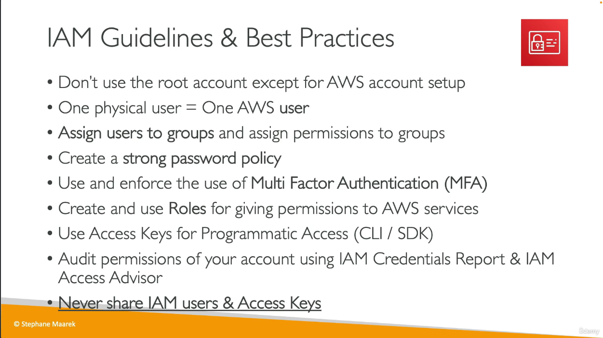

## Cloud Computing

![[Cloud Computing]]
## Pricing

- AWS pricing fundamentals:
    - **Compute**
    - **Storage**
    - **Data transfer** - pay only for data transferred *out* of the cloud
## Shared Responsibility Model

> [!quote] Shared Responsibility Model
> Security and Compliance is a shared responsibility between AWS and the customer.


- **Source**: [AWS](https://aws.amazon.com/compliance/shared-responsibility-model/) 
## Concepts

### Regions

- Cluster of data centers
- Most AWS services are region-scoped.

**What determines where to launch a new service?**
- ==Compliance== - Data never leaves a region w/o explicit permission
- ==Customer Proximity== - Reduced latency
- ==Service Availability== - Not all services are available in every region 
- ==Pricing== - Varies from region to region

### Availability Zones (AZ)

- Within each region, there are several separate yet connected availability zones, usually anywhere from 3 to 6.
- Each AZ contains one or more data centers, each with redundant power, networking and connectivity.
- AWS Region: Sydney (ap-southeast-2)
    - ap-southeast-2a, ap-southeast-2b, ap-southeast-2c
### Points of Presence (Edge Locations)

- Deliver content to end users with low latency. 
- 400+ in 90+ cities across 40+ countries.


## Services

- **Global**: IAM, Route 53, CloudFront, WAF
- **Regional**: EC2, Elastic Beanstalk, Lambda, Rekognition
### Global
#### Identity and Access Management (IAM)

- Root account is created by default and associated with an organization.
- Users
    - People within an organization 
    - Can be grouped
    - Can belong to multiple groups
    - Don't necessarily have to be part of a group
- Groups
    - Only contain users, not other groups
- Policies
    - JSON documents that define permissions
    - Assigned to users (Inline) or groups 
    - **Policy Structure**
        - `Version` - Policy language version (2012-10-17)
        - `Id` - Optional Policy identifier
        - `Statement` - One or more (required)
            - `Sid` - Optional statment identifier
            - `Effect` - '`Allow`' or '`Deny`' access
            - `Principal` - account/user/role to which the policy is applied
            - `Action` - list of allowed or denied actions
            - `Resource` - list of resources the actions apply to
            - `Condition` - Optional conditions that determine when the policy is in effect

```json
{
    "Version": "2012-10-17",
    "Statement": [
        {
            "Effect": "Allow",
            "Action": [
                "ec2:AttachVolume",
                "ec2:DetachVolume"
            ],
            "Resource": "arn:aws:ec2:*:*:instance/*",
            "Condition": {
                "StringEquals": {"aws:ResourceTag/Department": "Development"}
            }
        }
        ...
    ]
}
```
- Best Practices
    - 

**Password Policies**
- Min length
- Whether changing own password is allowed
- Character types required, 
- Expiration date
- Prevent re-use of passwords (that were used within a certain date range)

**MFA Options**
- Virtual MFA devices - Single device / multi-token
    - e.g. Authy
- U2F - Single key / multi-user (root or IAM)
    - e.g. YubiKey
- Hardware
    - Key fob devices
##### Ways to Access AWS

- **AWS Management Console (Web UI)** - Password + MFA
- **AWS CLI** - Secret Access Keys
    - Alternative to using the management console web UI.
- **AWS SDK** - Secret Access Keys
    - Language and platform-specific libraries
    - Embedded within applications to manage AWS services programmatically

> [!note]
> Users manage their own access keys.
##### IAM Roles for Services

- Permissions assigned to AWS services, so they can perform actions on user's behalf.
- Common roles include EC2 roles, Lambda Roles, etc
##### IAM Security Tools

- **IAM Credentials Report** - Account-level
    - Lists all users and their credential status under an account
- **IAM Access Advisor** - User-level
    - Lists service permissions granted to a user along with its last access time
    - Can be used to revise policies using the Least Priviledge approach

### Regional
#### Elastic Compute Cloud (EC2)

- IaaS
    - Rent VMs (via EC2)
    - Data storage on virtual drives (via EBS)
    - Load distribution across machines (via ELB)
    - Service auto-scaling (via ASG)
- Can be configured to meet demands
    - OS
    - CPU & RAM
    - Storage Type and Amount
        - Network-attached (EBS / EFS)
        - Hardware (EC2 instance store)
    - Network Card
    - Firewall Rules
    - Bootstrap Script
        - Automated launch commands that run once (with root user permissions) on machine boot
            - e.g. Install updates/software, download files
- Instance types can be created that are optimized for different use cases 
    - Storage optimized
    - Network optimized
    - Memory optimized
    - Compute optimized
- General purpose instances provide a balance of the different resources. These are great for various types of workloads such as setting up web servers.
- An example name for an instance type can be `t2.micro`:
    - ==t== - instance class
    - ==2== - generation
    - ==micro== - size within instance class
##### Security Groups

- Fundamental to AWS network security.
- 'Firewall' around EC2 instances to control inbound and outbound traffic.
    - Access to ports
    - Authorized IP ranges (IPv4 & IPv6)
- Only contain allow rules
- Rules can be referenced by IP or by security group
- Can be attached to multiple instances
- Scoped to a region/VPC combination
- If application
    - times out, the issue is because of a security group
    - refuses connection, the issue is because of an application or launch error
- By default, 
    - all inbound traffic is blocked.
    - all outbound traffic is authorized.

> It is considered best practice to maintain one separate security group for SSH access.

**Common Ports**
- 21
    - File Transfer Protocol (FTP)
    - Upload files
- 22 
    - Secure Shell (SSH)
    - Log into a Linux machine
    - Also for Secure File Transfer Protocol (SFTP) - upload files using SSH
- 80
    - HTTP
    - Access unsecure websites
- 443
    - HTTPS
    - Access secure websites
- 3389
    - Remote Desktop Protocol (RDP)
    - Log into a Windows machine

> [!important]
> Never enter access keys into EC2 instance.
##### Purchase Options

- **On-Demand**
    - short-term, uninterrupted and unpredictable workloads
    - pay by the second (Linux / Windows)
    - pay by the hour (Other OS)
    - Highest cost with no upfront payment
    - No long term commitment
- **Reserved**
    - Reserve specific instance attributes: type, region, OS, tenancy
    - Reservation period: 1 & 3 years
    - Payment can be made all upfront (cheapest), partially upfront or none upfront.
    - Reserved Instances (RI)
        - Long, steady workloads (e.g. databases)
        - Can be bought or sold in the RI Marketplace 
        - Scope: Regional or Zonal
    - Convertible Reserved Instances
        - Long workloads with flexible instances
        - Attributes can be changed
- **Savings Plans**
    - 1 & 3 years
    - Long workload
    - Get a discount based on long-term usage
    - Commit to amount of usage (e.g. $X/hour for 1 or 3 years)
    - Usage past commitment is billed at On-demand pricing
    - Locked to a specific instance family and region
    - Flexibility across instance size, OS and tenancy
- **Spot Instances**
    - Most cost-efficient
    - Short workloads resilient to failure
        - e.g. image processing, data analysis
    - Less reliable; Can be lost
- **Dedicated Hosts**
    - Most expensive
    - Entire physical server
        - Visibility into low-level hardware
        - Targeted instance placement
        - Address strong regulatory or compliance needs
        - Useful for software with complicated licensing (BYOL)
    - Either on-demand or reserved
    - Per host billing
- **Dedicated Instances**
    - Hardware not shared with others
        - May be shared with other instances on same account.
    - No control over instance placement
    - Per instance billing
- **Capacity Reservations**
    - Reserved on-demand capacity in specific AZ for any duration
    - No time commitment or billing discounts
    - Short-term, uninterrupted workloads in a specific AZ
    - On-demand charge rate regardless of running instances

> [!question]
> Which option is suitable for a certain type of workload?
##### Shared Responsibility Model for EC2

- The customer is responsible for 
    - OS patches and updates
    - Software and utilities installed on an instance
    - Security group rules, IAM roles and IAM user access


#### Elastic Block Store (EBS)


## Further

### Learn 🧠

- [AWS Cloud Solutions Architect Professional Certificate - Coursera](https://www.coursera.org/professional-certificates/aws-cloud-solutions-architect)

- [Ultimate AWS Certified Developer Associate 2023 NEW DVA-C02](https://www.udemy.com/course/aws-certified-developer-associate-dva-c01/)

- [Ultimate AWS Certified Solutions Architect Associate SAA-C03 - Udemy](https://www.udemy.com/course/aws-certified-solutions-architect-associate-saa-c03/)