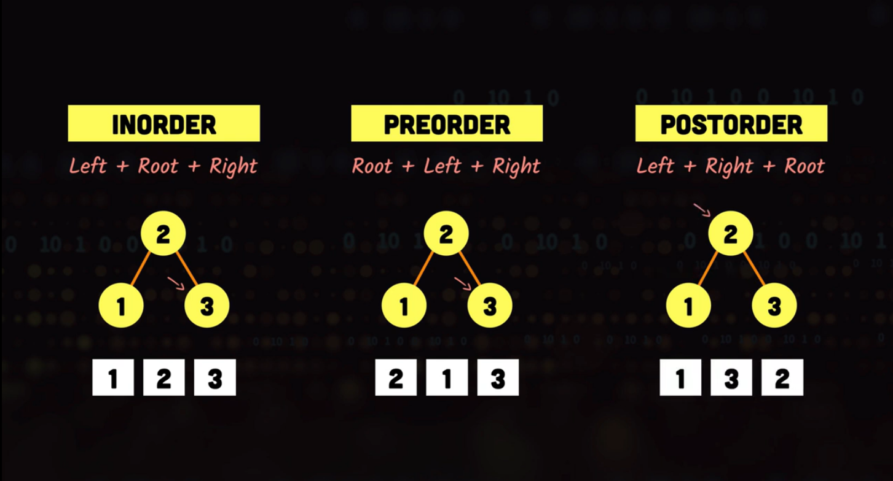

- An ==algorithm== is a series of steps that solve a particular problem.
    - The steps are clear and unambiguous.
    - The algorithm stops after a finite number of steps.
    - The same output should always be produced for a given input.
- The run time of an algorithm is the amount of time it takes a computer to execute the algorithm.
- The important part of an algorithm is the part that grows the fastest as its input size gets bigger.
- An algorithm's efficiency is usually expressed using [[Big-O]].
- An algorithm's **_order-of-magnitude_** dominates the equation and it describes the [[time complexity]] of an algorithm. Additionally, resource usage [[space complexity]]) should also be considered.

## Common Complexities

- Complexities ordered from most efficient (best) to least efficient (worst) in [[Big-O]], where n is the size of the input.
    - **Constant Time**: ==$O(1)$==
    - **Logarithmic Time**: ==$O(log(n))$==
        - Usually the algorithm reduces the computation amount by a certain amount in each iteration.
        - e.g. Binary search
    - **Linear Time**: ==$O(n)$==
        - e.g. Linear search
    - **Linearithmic / Log-linear Time**: ==$O(nlog(n))$==
        - e.g. Merge sort
    - **Quadric Time**: ==$O(n^2)$==
        - e.g. Insertion sort, bubble sort
    - **Cubic Time**: ==$O(n^3)$==
    - **Exponential Time**: ==$O(b^n), b > 1$==
        - e.g. Brute-force algorithms - test every possible option.
    - **Factorial Time**: ==$O(n!)$==

- **Best-case complexity** - how an algorithm performs with ideal output.
- **Worst-case complexity** - how an algorithm performs in the worst possible scenario.
- **Average-case complexity** - how an algorithm performs on average; this is often used as a starting point when comparing algorithms.


- **Source**: [Big-O Cheat Sheet](https://www.bigocheatsheet.com)

## Recursion

- A recursive algorithm must:
    - have a base case
    - move closer to the base case
    - call itself recursively
- Recursive algorithms typically
    - take up more memory than their iterative alternatives.
    - can be less efficient.
        - e.g. The Big-O of a recursive Fibonacci algorithm is $O(2^n)$.
- Consider using ==recursion== for Divide and Conquer problems; when 
    - a problem can be divided into subproblems that are identical in nature.
    - solutions for each subproblem can be combined to solve the whole problem.
        - e.g. using a tree or creating a tree from something.

> Anything that can be implemented recursively can also be done iteratively.

- Tail recursion ==?==
- Non-tail recursion ==?==

## Searching

### Sequential / Linear search

- Iterates thru every element in a data set and compare it with the target value.
- Python's built-in `in` operator is linear.

- **Best case**: $O(1)$
- **Worst case**: $O(n)$
- **Average case**: $O(n/2)$

### Binary search

- List must be sorted.
- After $x$ iterations, the number of items in the list will be reduced to $n/2^x$.
- To calculate how many iterations it will take a binary search to determine an item is not there, solve for $x$ in $2^x = n$, where $n$ is the input size.

- **Best case**: $O(\log n)$
- **Worst case**: $O(n)$
- **Average case**: $O(n/2)$

## Sorting

### Bubble Sort

- Consecutive pairs of items are compared and the larger of the pair is ==bubbled up== the list. This can be accomplished using two nested for loops.
- **Time complexity**: $O(n^2)$
- **Space complexity**: $O(1)$

### Selection Sort

- First item of a list is set to be the minimum value. The list is then traversed and if a new smaller value is encountered it is ==selected== to be the minimum value. At the end of each iteration, the new minimum value is swapped places with the first / *original* minimum value.
    - This can be accomplished using two nested for loops.
- **Time complexity**: $O(n^2)$
- **Space complexity**: $O(1)$

### Insertion Sort

- **Time complexity**: $O(n^2)$
- **Space complexity**: $O(1)$

### Merge Sort

- **Time complexity**: $O(n\log (n))$
- **Space complexity**: $O(n)$

### Quick Sort

- **Time complexity**: $O(n^2)$
- **Space complexity**: $O(\log (n))$

### Heap Sort

- **Time complexity**: $O(n\log (n))$
- **Space complexity**: $O(1)$

## Traversals

- Traversing is visiting each node in a data structure.
- Typically have a [[time complexity]] of $O(n)$.

### Breadth-First Search / Traversal (BFS)

- Ideal for shortest path / closest node type of problems
- More memory than DFS
- Requires too much memory for really wide trees
- Preferred for deep trees
- Uses a ==queue==

### Depth-First Search / Traversal (DFS)

- Ideal for problems similar to finding the existence of a path between nodes.
- Less memory
- Can be slow specially for really deep trees
- Preferred for wide trees
- Uses a ==stack==
- Can be implemented in three ways:
    - Pre-Order Traversal
    - Post-Order Traversal
    - In-Order Traversal


- **Source**: [The Roadmap](https://roadmap.sh)

## Dynamic Programming (DP)

- Utilizes some form of optimization for problems where the solution can be composed of solutions to subproblems of identical nature with smaller inputs. 
    - e.g. Fibonacci sequence problem 
- ==**DP** = **Divide & Conquer** + **Memoization**==

### Top-down: Memoization

![[Memoization]]

### Bottom-up

**Example**

- A top-down approach to calculate the first `n` integers may look like this:

```python
# Memory cost: O(n)
def first_n_product(n):
    return n * first_n_product(n - 1) if n > 1 else 1
```

- The same problem can be solved using the bottom-up approach with way less memory cost:

```python
# Memory cost: O(1)
def first_n_product(n):
    result = 1
    
    for num in range(1, n+1):
        result *= num

    return result
```


## ---

## String Search

## Graphs

- Dijkstra's Algorithm
- [BFS / DFS](https://visualgo.net/en/dfsbfs)

## Hashing

## Assorted

- Divide & Conquer
- Shortest Paths
- Flow networks
- Back Tracking
- Greedy algorithms
- Minimum spanning trees
- Complexity classes
    - NP-completeness

## Further

### Learn 🧠

- [Algorithmic Design and Techniques - edX](https://www.edx.org/course/algorithmic-design-and-techniques)

### Books 📚

- [Cracking the Coding Interview](https://app.thestorygraph.com/books/61084720-073b-4d8b-b71a-7cc3fb77daa2)

- [Introduction to the Design and Analysis of Algorithms](https://app.thestorygraph.com/books/7b23f4fb-42ec-48e5-a0d4-f5b8575e6b2c)

- [The Algorithm Design Manual](https://app.thestorygraph.com/books/8783f581-7ded-4bd6-b8b7-67e464419018)

### Resources 🧩

- [Algorithm Visualizer](https://algorithm-visualizer.org/)

- [Open Data Structures](https://opendatastructures.org/ods-python.pdf)

- [Sorting Algorithms Animations](https://www.toptal.com/developers/sorting-algorithms)

- [The Algorithms](https://the-algorithms.com/)

- [VisuAlgo](https://visualgo.net/en)
