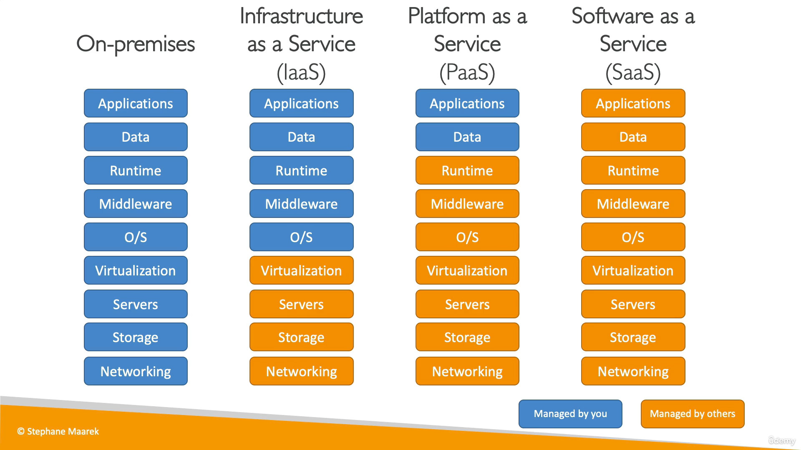

- ==Cloud computing== - on-demand and customized delivery of computing resources: compute power, storage, application code servers, and more.
## Characteristics

- Resources accessible over any network by various clients
- On-demand, self-service
- Multi-tenancy & resource pooling
    - Multiple customers can share the same physical infra securely and privately
- Rapid elasticity and scalability
    - Customizable to meet needs as they change
- Measured service - pay-as-you-go pricing model
## Advantages

- Reduced total cost of ownership (TCO) and operational expense (OPEX)
    - Reduced cost of running/maintaining data centers
- Reduced cost because of large scale efficiency
- Scalable based on measured usage - no guesswork
- Increased development/deployment speed & agility
- Make use of a global infra
## Deployment Models

- Public Cloud:
    - Cloud resources owned by a third party and delivered over the internet.
- Hybrid Cloud:
    - Some servers are kept on premises, and some capabilities are extended to the cloud.
    - More control/security over sensitive assets
## Types

### Infrastructure as a Service (IaaS)

- Provide building blocks for cloud: networking, hardware, storage, virtualization
- More flexible
- Easy compatibility with private (on-premises) cloud
- e.g. AWS EC2, GCP, Azure, Rackspace, DigitalOcean, Linode
### Platform as a Service (IaaS)

- Managed underlying infra
- Focus on deployment/management of data & apps
- e.g. AWS Elastic Beanstalk, Heroku, GCP Google App Engine, Windows Azure
### Software as a Service (IaaS)

- Complete cloud product is run and managed by a service provider
- e.g. AWS Rekognition, Proton Mail, Google Drive, Microsoft Teams

- Credit: [Ultimate AWS Certified Cloud Practitioner](https://www.udemy.com/course/aws-certified-cloud-practitioner-new/)