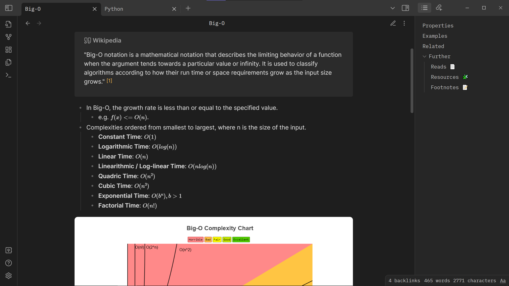

This repo contains my notes on various technical topics.

Most of my notes are not yet complete, but they get updated regularly. Some just contain an outline of potential concepts I might learn about or experiment with.

Currently, I use [Obsidian](https://obsidian.md) as my note-taking app. Specific features like [internal links](https://help.obsidian.md/Linking+notes+and+files/Internal+links) and [callouts](https://help.obsidian.md/How+to/Use+callouts) are among of the things I use frequently. So, some of the raw markdown syntax may not make sense unless it is opened in an Obsidian vault.

